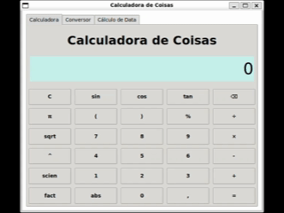
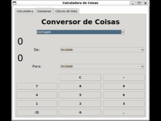
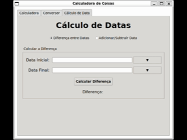

# Calculadora de Coisas


## Visão geral

Calculadora de Coisas é uma aplicação Python com interface gráfica em Tkinter que oferece:

- calculadora avançada com expressões, porcentagem, fatorial e notação científica;
- conversor de unidades para medidas, câmbio e sistemas numéricos;
- calculadora de diferença entre datas e adição/subtração de períodos;
- interface retrô e intuitiva para uso rápido.

## Demonstração

| Calculadora | Conversor | Datas |
|---|---|---|
|  |  |  |

## Funcionalidades principais

- suporte a operações básicas e avançadas
- avaliação de expressões com limpeza de operadores finais
- funções científicas imediatas com ambiente seguro de `eval()`
- conversor de unidades diversas
- calculadora de datas com diferença e soma de períodos
- geração de executáveis nativos para Windows, Linux e macOS via GitHub Actions

## Requisitos

- Python 3.12+
- `tkinter` disponível no sistema
- dependências de runtime instaladas via `requirements.txt`

## Como executar

### 1. A partir do código-fonte

#### Windows

```bat
python -m venv .venv
.venv\Scripts\activate
pip install -r requirements.txt
python main.py
```

#### Linux / macOS

```bash
python3 -m venv .venv
source .venv/bin/activate
pip install -r requirements.txt
python main.py
```

### 2. Usando os scripts de inicialização

Os scripts `run_app.bat` e `run_app.sh` são wrappers de conveniência para criar/ativar ambiente virtual e iniciar a aplicação.

- Windows: execute `run_app.bat`
- Linux / macOS: execute `chmod +x run_app.sh && ./run_app.sh`

> Nota: `run_app.sh` não instala dependências de sistema do Tk, então instale o pacote em seu sistema se necessário.

### 3. Usando os executáveis gerados pelo GitHub Actions

O workflow em `.github/workflows/build-executables.yml` gera executáveis nativos para Windows, Linux e macOS usando Nuitka.

- Artefatos de build ficam disponíveis em `Actions → Build executables`.
- Para criar uma nova versão publicada, crie uma tag `vX.Y` e faça push.

#### Executáveis

- Windows: `ThingCalculator_vX.Y_windows_x64.exe`
- Linux: `ThingCalculator_vX.Y_linux_x64`
- macOS: `ThingCalculator_vX.Y_macos_x64`

#### Instrução Linux / macOS

```bash
chmod +x ThingCalculator_vX.Y_platform_x64
./ThingCalculator_vX.Y_platform_x64
```

## Estrutura do projeto

- `main.py` — ponto de entrada da aplicação
- `thing/` — módulos de interface e lógica
- `requirements.txt` — dependências de runtime
- `.github/workflows/build-executables.yml` — pipeline de build com Nuitka
- `run_app.bat` / `run_app.sh` — wrappers para execução local

## Notas sobre `.bat` e `.sh`

Os scripts ainda são úteis para quem roda o projeto a partir do código-fonte. Se você distribuir apenas executáveis, eles não são obrigatórios, mas continuam uma opção prática para desenvolvimento e testes.

## Atualizações recentes

- suporte ao macOS com executáveis nativos
- cálculo de funções científicas com `eval()` seguro
- refatoração e organização de código para melhor manutenção
- workflow de build ajustado para release automática via tags
